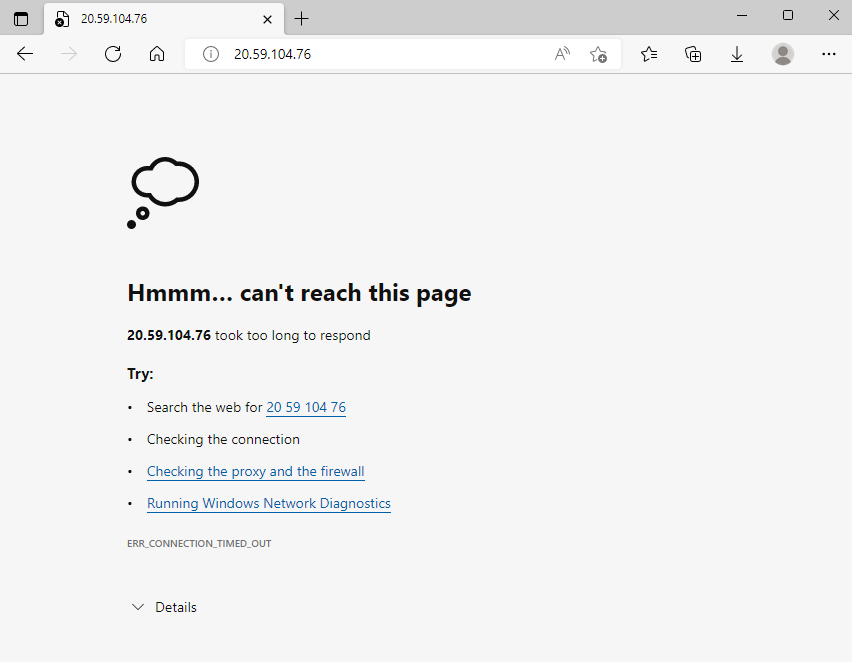
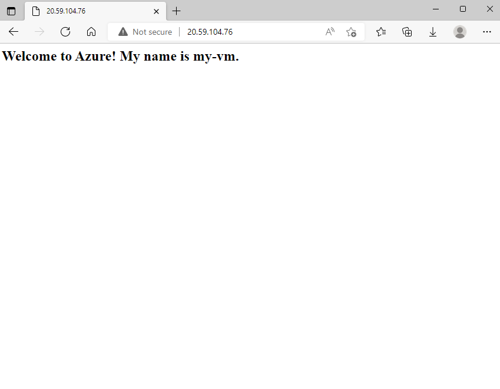

---
lab:
  title: 演習 - 仮想マシンを作成し、Web ホストとして構成する
  module: Module 01 - Describe the core architectural components of Azure
  description: この演習では、Azure 仮想マシン (VM) を作成し、Web サーバーをインストールして、インターネットからのアクセスを許可するようにネットワーク構成を更新します。
  duration: 20 minutes
  level: 300
  islab: true
  primarytopics:
    - Azure
    - Virtual Machines
---

<!--
Edit the metadata above to manage the list of exercises in the home page of the GitHub site that gets generated.
You can delete the module and edit index.md in the root of the repo to customize the display so that only the exercises are listed
To enable GitHub page publishing, edit the Page settings for the repo and publish from the main branch
-->

# 仮想マシンを作成し、Web ホストとして構成する <!-- match title in metadata above (and Learn Exercise unit and ILT slide)-->

この演習では、Azure 仮想マシン (VM) を作成し、Web サーバーをインストールして、インターネットからのアクセスを許可するようにネットワーク構成を更新します。

この演習の所要時間は約 **20** 分です。 <!-- update with estimated duration -->

> [!IMPORTANT]
> この演習を終えるには、リソース グループ、仮想マシン、ネットワーク リソースを作成するための十分なアクセス許可を持って Azure サブスクリプションにアクセスする必要があります。

この演習の手順を行うには、Azure portal、Azure CLI、または Azure Resource Manager (ARM) テンプレートを使用できます。

この例では、VM をデプロイするには Azure portal を使い、構成とネットワークのタスクには Cloud Shell の Azure CLI を使います。

## タスク 1: リソース グループを作成する
最初のタスクでは、リソース グループを作成します。 この演習の間に作成される他のすべてのものは、そのリソース グループ内に作成されます。

1. [Azure Portal](https://portal.azure.com/?azure-portal=true) にログインします。
1. **[リソース グループ]** を選択します。
1. **［作成］** を選択します
1. この演習に使うサブスクリプションを選びます。
1. リソース グループ名として「**IntroAzureRG**」と入力します。
1. **[リージョン]** では、お使いのサブスクリプションで利用できて、D シリーズの Linux VM サイズを使用できる Azure リージョンを選びます。
1. **[確認と作成]** を選択し、次に **[作成]** を選択します。

## タスク 2: Linux 仮想マシンを作成する
このタスクでは、Azure portal を使って、タスク 1 のリソース グループに Linux VM を作成します。

1. **[ホーム]** を選択します。
1. **[リソースの作成]** を選択します。
1. [カテゴリ] で **[インフラストラクチャ サービス]** を選びます。
1. **[仮想マシン]** で、**[作成]** を選択します。
1. **[基本]** タブでは次の値を使い、指定されていない限り、他の設定は既定値のままにします。

    | **設定**                  | **Value**                                       |
    | ---------------------------- | ----------------------------------------------- |
    | サブスクリプション                 | タスク 1 で選んだサブスクリプションを選びます。 |
    | リソース グループ               | IntroAzureRG                                    |
    | 仮想マシン名         | `my-vm`                                         |
    | リージョン                       | IntroAzureRG と同じ                            |
    | ゾーンのオプション​​                 | 既定値のままにする                                   |
    | 可用性ゾーン            | 既定値のままにする                                   |
    | セキュリティの種類                | 既定値のままにする                                   |
    | Image                        | 既定値のままにする                                   |
    | VMアーキテクチャ              | 既定値のままにする                                   |
    | Azure Spot 割引で実行する | Unchecked                                       |
    | サイズ                         | 既定値のままにする                                   |
    | 認証               | Password                                        |
    | Username (ユーザー名)                     | `azureuser`                                     |
    | Password (パスワード)                     | カスタム パスワードを入力する                         |
    | パスワードの確認             | カスタム パスワードを再入力する                     |
    | パブリック受信ポート         | 既定値のままにする                                   |
    | 受信ポートの選択         | 既定値のままにする                                   |


1. **[確認と作成](確認と作成)** を選択し、次に **[作成]** を選択します。
1. VM のデプロイが完了するまで待ちます。

VM のプロビジョニングには少し時間がかかる場合があります。 VM には **my-vm** という名前を付けました。後でその名前に基づいて VM を参照します。

しばらく待ち、**[デプロイが進行中です。]** が  **[デプロイが完了しました。]** に変わったら 続けます。

## タスク 3: NGINX をインストールする
VM が作成された後、カスタム スクリプト拡張機能を使って NGINX をインストールします。 カスタム スクリプト拡張機能は、Azure VM でスクリプトをダウンロードして実行する簡単な方法です。 これは、VM が稼働してからシステムを構成できるさまざまな方法の 1 つに過ぎません。

1. Azure Cloud Shell アイコンを選んで Azure Cloud Shell を起動します。
1. PowerShell モードではなく Bash モードであることを確認します。 わからない場合は、Azure Cloud Shell コマンド ラインで「`bash`」と入力します。

1. 次の `az vm extension set` コマンドを実行して、VM 上に Nginx を構成します。
    
    ```azurecli
    az vm extension set \
      --resource-group "IntroAzureRG" \
      --vm-name my-vm \
      --name customScript \
      --publisher Microsoft.Azure.Extensions \
      --version 2.1 \
      --settings '{"fileUris":["https://raw.githubusercontent.com/MicrosoftDocs/mslearn-welcome-to-azure/master/configure-nginx.sh"]}' \
      --protected-settings '{"commandToExecute": "./configure-nginx.sh"}'    
    ```
    
    このコマンドでは、カスタム スクリプト拡張機能を使用して、VM 上で Bash スクリプトを実行します。 このスクリプトは GitHub に格納されています。 コマンドの実行中、別のブラウザー タブから [Bash スクリプトを調べること](https://raw.githubusercontent.com/MicrosoftDocs/mslearn-welcome-to-azure/master/configure-nginx.sh?azure-portal=true)を選択できます。まとめると、スクリプトでは次のことが行われます。
    
    
    1.  `apt-get update` を実行して、インターネットから最新のパッケージ情報をダウンロードします。 この手順によって、次のコマンドで Nginx パッケージの最新バージョンを確実に見つけることができます。
    2.  Nginx をインストールします。
    3.  ホームページ */var/www/html/index.html* を設定して、VM のホスト名を含むウェルカム メッセージを出力します。

現時点では、前の演習の間に作成して NGINX をインストールした VM には、インターネットからアクセスできません。 次の数ステップでは、ポート 80 での受信 HTTP アクセスを許可することでそれを変更するネットワーク セキュリティ グループを作成します。

> [!NOTE]
> この演習のいくつかのコマンドは、Cloud Shell の Bash バージョンで実行することが重要です。 現在 PowerShell モードになっている場合は、**[切り替え...]** ボタンを使用できます。

## タスク 4: Web サーバーにアクセスする

この手順では、VM の IP アドレスを取得し、Web サーバーのホーム ページへのアクセスを試します。

1.  次の `az vm list-ip-addresses` コマンドを実行して、VM の IP アドレスを取得し、その結果を Bash 変数として格納します。
    
    ```bash
    IPADDRESS="$(az vm list-ip-addresses \
      --resource-group "IntroAzureRG" \
      --name my-vm \
      --query "[].virtualMachine.network.publicIpAddresses[*].ipAddress" \
      --output tsv)"    
    ```
2.  次の `curl` コマンドを実行して、ホームページをダウンロードします。
    
    ```bash
    curl --connect-timeout 5 http://$IPADDRESS
    ```
    
    `--connect-timeout` 引数で、接続が発生するまで最大 5 秒の時間を許可することを指定します。 5 秒後に、接続がタイムアウトしたことを示すエラー メッセージが表示されます。
    
    ```output
    curl: (28) Connection timed out after 5001 milliseconds
    ```
    
    このメッセージは、タイムアウト期間内に VM にアクセスできなかったことを意味します。
3.  省略可能な手順として、ブラウザーから Web サーバーへのアクセスを試してみます。
    
    
    1.  次を実行して、VM の IP アドレスをコンソールに出力します。
        
        ```bash
        echo $IPADDRESS       
        ```
        
        たとえば *23.102.42.235* のような IP アドレスが表示されます。
    2.  表示された IP アドレスをクリップボードにコピーします。
    3.  新しいブラウザー タブを開き、Web サーバーに移動します。 しばらくすると、接続が行われていないことがわかります。 ブラウザーがタイムアウトするまで待つと、次のように表示されます。

        
    5.  このブラウザー タブは後で使用するため、開いたままにしておきます。

## タスク 5: 現在のネットワーク セキュリティ グループ規則の一覧を表示する

Web サーバーにアクセスすることができませんでした。 理由を明らかにするために、現在の NSG 規則を調べてみましょう。

1.  次のコマンドを実行して、**my-vm** に関連付けられている NSG を検索し、NSG 名を Bash 変数に格納します。

    ```bash
    NSGID="$(az network nic list \
      --resource-group "IntroAzureRG" \
      --query "[?virtualMachine.id && contains(virtualMachine.id, '/my-vm')].networkSecurityGroup.id | [0]" \
      --output tsv)"

    NSGNAME="${NSGID##*/}"
    echo $NSGNAME
    ```

    出力に NSG 名が表示されます (例: *my-vmNSG* や *my-vm-nsg*)。
2.  次の `az network nsg rule list` コマンドを実行して、`$NSGNAME` という名前の NSG に関連付けられている規則の一覧を表示します。
    
    ```azurecli
    az network nsg rule list \
      --resource-group "IntroAzureRG" \
      --nsg-name "$NSGNAME"    
    ```
    
    JSON 形式の大きなテキスト ブロックが出力として表示されます。 次の手順で、この出力を読みやすくするための似たようなコマンドを実行します。
3.  `az network nsg rule list` コマンドをもう一度実行します。 今回は、`--query` 引数を使用して、各規則の名前、優先度、影響を受けるポート、およびアクセス (**許可**または**拒否**) のみを取得します。 `--output` 引数によって、読みやすくするために出力が表として書式設定されます。
    
    ```azurecli
    az network nsg rule list \
      --resource-group "IntroAzureRG" \
      --nsg-name "$NSGNAME" \
      --query '[].{Name:name, Priority:priority, Port:destinationPortRange, Access:access}' \
      --output table    
    ```
    
    次のような出力が表示されます。
    
    ```output
    Name              Priority    Port    Access
    -----------------  ----------  ------  --------
    SSH                300         22      Allow
    ```
    
    既定の規則 *SSH* が表示されます。 この規則によって、ポート 22 (SSH) 経由の受信接続が許可されます。 SSH (Secure Shell) は、管理者がシステムにリモートでアクセスできるようにするために、Linux で使用されるプロトコルです。 この規則の優先度は 300 です。 規則は優先度順に処理され、小さい数値を持つ規則が大きな数値のものよりも前に処理されます。

既定では、Linux VM の NSG では、ポート 22 でのネットワーク アクセスのみが許可されます。 このポートを使用して、管理者はシステムにアクセスできます。 さらに、HTTP 経由のアクセスを許可するポート 80 での受信接続も許可する必要があります。

## タスク 6: ネットワーク セキュリティ規則を作成する

ここでは、ポート 80 (HTTP) での受信アクセスを許可するネットワーク セキュリティ規則を作成します。

1.  次の `az network nsg rule create` コマンドを実行して、ポート 80 での受信アクセスを許可する *allow-http* という名前の規則を作成します。
    
    ```azurecli
    az network nsg rule create \
      --resource-group "IntroAzureRG" \
      --nsg-name "$NSGNAME" \
      --name allow-http \
      --protocol tcp \
      --priority 100 \
      --destination-port-range 80 \
      --access Allow    
    ```
    
    学習目的のために、ここでは優先度を 100 に設定します。 この例では優先度は重要ではありません。 ポート範囲が重複している場合は、優先度を考慮する必要があります。
2.  構成を検証するために、`az network nsg rule list` を実行して、更新された規則の一覧を表示します。
    
    ```azurecli
    az network nsg rule list \
      --resource-group "IntroAzureRG" \
      --nsg-name "$NSGNAME" \
      --query '[].{Name:name, Priority:priority, Port:destinationPortRange, Access:access}' \
      --output table    
    ```
    
    *default-allow-ssh* 規則と、新しい規則である *allow-http* の両方が表示されます。
    
    ```output
    Name              Priority    Port    Access
    -----------------  ----------  ------  --------
    SSH                300         22      Allow
    allow-http         100         80      Allow    
    ```

## タスク 7: Web サーバーにもう一度アクセスする

これでポート 80 へのネットワーク アクセスを構成したので、Web サーバーにもう一度アクセスしてみましょう。

> [!NOTE]
> NSG を更新した後、更新されたルールが伝達されるまでに少し時間がかかることがあります。 目的の結果が得られるまで、試行の間に一時停止して、次の手順を再試行します。

1.  先ほど実行したのと同じ `curl` コマンドを実行します。
    
    ```bash
    curl --connect-timeout 5 http://$IPADDRESS
    ```
    
    この応答が表示されます。
    
    ```html
    <html><body><h2>Welcome to Azure! My name is my-vm.</h2></body></html>
    ```
2.  省略可能な手順として、Web サーバーを指すようにブラウザー タブを更新します。 ホーム ページが表示されます。

   

よくできました。 実際には、必要な受信と送信のネットワーク アクセス規則を含むスタンドアロン ネットワーク セキュリティ グループを作成できます。 同じ目的で使用される VM が複数ある場合は、作成時に各 VM にその NSG を割り当てることができます。 この手法を使用して、複数の VM へのネットワーク アクセスを、単一の一元的な規則セットで制御できます。

この演習と、このモジュールのすべての演習を完了しました。 お使いの Azure 環境をクリーンアップし、使っていない VM が実行状態のままにならないようにするため、**IntroAzureRG** リソース グループを削除します。

## クリーンアップ
1. Azure のホーム ページで、[Azure サービス] の下にある **[リソース グループ]** を選びます。
1. **[IntroAzureRG]** リソース グループを選びます。
1. **[リソース グループの削除]** を選択します。
1. **[選択した仮想マシンと仮想マシン スケール セットに対して強制削除を適用する]** ボックスが表示されている場合は、それがオンになっていることを確認します。
1. 「`IntroAzureRG`」と入力してリソース グループの削除を確認します
1. 確認ウィンドウで **[削除]** を選びます。
