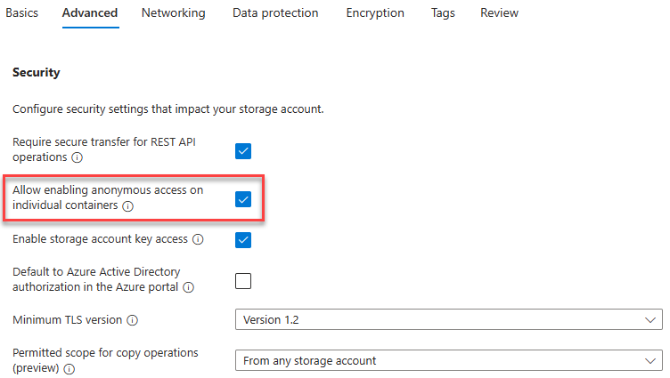
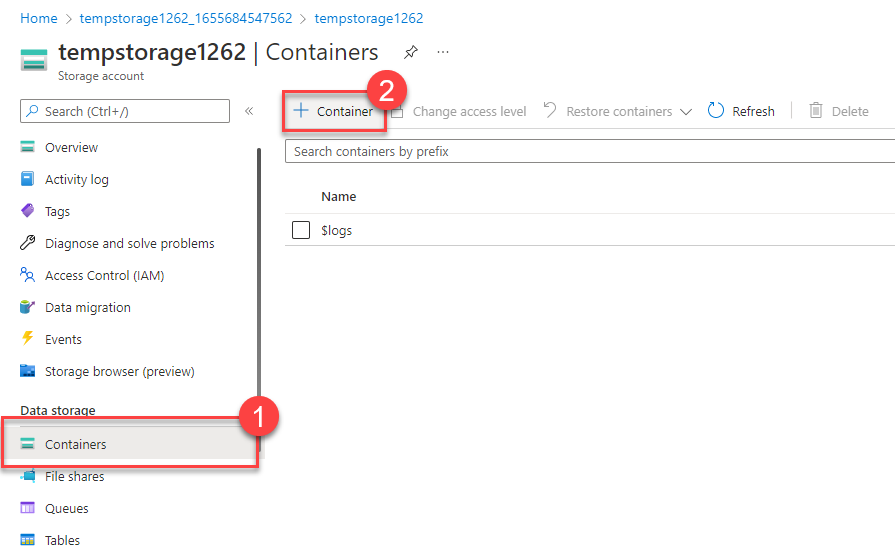

---
lab:
  title: 演習 - ストレージ BLOB を作成する
  module: Module 01 - Describe the core architectural components of Azure
  description: この演習では、Azure ストレージ コンテナーを作成し、ファイルを Blob Storage にアップロードしてから、ファイルへのアクセスを許可するように Blob Storage を構成します。
  duration: 15 minutes
  level: 100
  islab: true
  primarytopics:
    - Azure
    - Azure Storage
---

<!--
Edit the metadata above to manage the list of exercises in the home page of the GitHub site that gets generated.
You can delete the module and edit index.md in the root of the repo to customize the display so that only the exercises are listed
To enable GitHub page publishing, edit the Page settings for the repo and publish from the main branch
-->

# ストレージ BLOB を作成する <!-- match title in metadata above (and Learn Exercise unit and ILT slide)-->

この演習では、Azure ストレージ コンテナーを作成し、ファイルを Blob Storage にアップロードしてから、ファイルへのアクセスを許可するように Blob Storage を構成します。

この演習の所要時間は約 **15** 分です。 <!-- update with estimated duration -->

> [!IMPORTANT]
> この演習を終えるには、リソース グループ、ストレージ アカウント、BLOB コンテナーを作成するための十分なアクセス許可を持って Azure サブスクリプションにアクセスする必要があります。
> お使いの環境で Azure リージョンが制限されている場合は、ストレージ アカウントの作成時に許可される Azure リージョンを選びます。


## タスク 1:ストレージ アカウントを作成する <!-- Change to an appropriate task title with an imperative verb phrase (e.g. "Do something") -->

このタスクでは、新しいストレージ アカウントを作成します。

1.  Azure portal ([https://portal.azure.com](https://portal.azure.com/?azure-portal=true)) にサインインする
2.  **[リソースの作成]** を選択します。
3.  [カテゴリ] で **[インフラストラクチャ サービス]** を選びます。
4.  [ストレージ アカウント] で、**[新規作成]** を選択します。
5.  [ストレージ アカウントの作成] ブレードの **[基本]** タブで、次の情報を入力します。 その他は既定値のままにします。
    
    | **設定**          | **Value**                                                 |
    | -------------------- | --------------------------------------------------------- |
    | サブスクリプション         | この演習で使うサブスクリプションを選びます。 |
    | リソース グループ       | [新規作成] を選び、「`IntroAzureRG`」と入力して [OK] を選びます  |
    | ストレージ アカウント名 | 一意のストレージ アカウント名を作成する                      |
    | リージョン               | IntroAzureRG と同じ Azure リージョンを選びます                    |
    | パフォーマンス          | Standard                                                  |
    | 冗長性           | ローカル冗長ストレージ (LRS)                           |

6.  [ストレージ アカウントの作成] ブレードの **[詳細]** タブで、次の情報を入力します。 その他は既定値のままにします。
    
    | **設定**                                              | **Value** |
    | -------------------------------------------------------- | --------- |
    | 個々のコンテナーでの匿名アクセスの有効化を許可する | オン   |

    
     
7.  **[確認と作成]** を選んでストレージ アカウントの設定を確認し、Azure が構成を検証できるようにします。
8.  検証が完了したら、**[作成]** を選択します。 アカウントが正常に作成されたことを示す通知を待ちます。
9.  **[リソースに移動]** を選択します。

## タスク 2: Blob Storage を操作する

このセクションでは、BLOB コンテナーを作成し、画像をアップロードします。

1.  **[データ ストレージ]** で、**[コンテナー]** を選択します。

    

2.  **[+ コンテナーの追加]** を選んで、情報を入力します。
    
    | **設定**            | **Value**                      |
    | ---------------------- | ------------------------------ |
    | 名前                   | コンテナーの名前を入力します |
    | 匿名アクセス レベル | プライベート (匿名アクセスなし)  |
3.  ［作成］ を選択します
    
    > [!NOTE]
    > ステップ 4 では、画像が必要です。 コンピューターに既に存在する画像をアップロードする場合は、ステップ 4 に進みます。 そうでない場合は、新しいブラウザー ウィンドウを開き、Bingでイメージを検索して、イメージをコンピューターに保存します。
4.  Azure portal に戻り、作成したコンテナーを選んで、[アップロード] を選択します。
5.  アップロードする画像ファイルを参照します。 これを選択してから、[アップロード] を選択します。
    
    > [!NOTE]
    > この方法で、必要な数の BLOB をアップロードできます。 新しい BLOB がコンテナー内に一覧表示されます。
6.  アップロードした BLOB (ファイル) を選びます。 [プロパティ] タブで行う必要があります。
7.  URL フィールドから URL をコピーし、新しいタブに貼り付けます。次のようなエラー メッセージが表示されるはずです。
    
    ```
    <Error>
    <Code>ResourceNotFound</Code>
      <Message>The specified resource does not exist. RequestId:4a4bd3d9-101e-005a-1a3e-84bd42000000</Message>
    </Error>    
    ```

## タスク 3: BLOB のアクセス レベルを変更する

1.  Azure portal に戻ります。
2.  必要な場合は、階層リンクを使って、タスク 2 で作成したコンテナーに戻ります。
3.  **[アクセス レベルの変更]** を選択します。
4.  [匿名アクセス レベル] を [BLOB (BLOB 専用の匿名読み取りアクセス)] に設定します。

![[アクセス レベルの変更] が強調されているスクリーンショット。](./Media/blob-access-level.png)

5.  [OK] を選択します。
6.  先ほどファイルにアクセスしようとしたタブを更新します。

お疲れさまでした。この演習はこれで終わりです。 ストレージ アカウントを作成し、コンテナーをストレージ アカウントに追加してから、BLOB (ファイル) をコンテナーにアップロードしました。 その後、インターネットからファイルにアクセスできるようにアクセス レベルを変更しました。

## クリーンアップ
1. Azure のホーム ページで、[Azure サービス] の下にある **[リソース グループ]** を選びます。
1. **[IntroAzureRG]** リソース グループを選びます。
1. **[リソース グループの削除]** を選択します。
1. 「`IntroAzureRG`」と入力してリソース グループの削除を確認します
1. **[削除]** を選択します。
1. 確認ウィンドウで **[削除]** を選びます。


