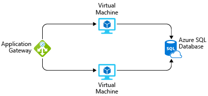

---
lab:
  title: 演習 - 料金計算ツールを使用してワークロードのコストを見積もる
  module: Module 04 - Describe cost management in Azure
  description: この演習では、料金計算ツールを使って、さまざまな Azure ワークロードの実行コストを見積もります。
  duration: 15 minutes
  level: 100
  islab: true
  primarytopics:
    - Azure
    - Cost Management
---

<!--
Edit the metadata above to manage the list of exercises in the home page of the GitHub site that gets generated.
You can delete the module and edit index.md in the root of the repo to customize the display so that only the exercises are listed
To enable GitHub page publishing, edit the Page settings for the repo and publish from the main branch
-->

# 料金計算ツールを使用してワークロードのコストを見積もる <!-- match title in metadata above (and Learn Exercise unit and ILT slide)-->

この演習では、料金計算ツールを使って、さまざまな Azure ワークロードの実行コストを見積もります。

この演習の所要時間は約 **15** 分です。 <!-- update with estimated duration -->

この演習では、料金計算ツールを使用して、Azure で基本的な Web アプリケーションを実行するコストを見積もります。

まず、必要な Azure サービスを定義することから始めます。

> [!NOTE]
> 料金計算ツールでは、情報が提供されるだけです。 料金は単なる見積もりであり、選択したどのサービスについても請求されることはありません。

## 要件を定義する

料金計算ツールを実行する前に、必要な Azure サービスを把握しておく必要があります。

データセンターでホストされている基本的な Web アプリケーションの場合は、次のような構成を実行できます。

Windows 上で実行する ASP.NET Web アプリケーション。 その Web アプリケーションでは、製品の在庫と価格に関する情報が提供されます。 中央のロード バランサーを通して接続されている 2 台の仮想マシンがあります。 Web アプリケーションは、在庫と価格の情報が保持されている SQL Server データベースに接続されます。

Azure に移行するには、次を使用できます。

 -  データセンターで使用する仮想マシンと同様に、Azure Virtual Machines インスタンスを使用します。
 -  負荷分散には Azure Application Gateway を使用します。
 -  在庫と価格の情報を保持するには、Azure SQL Database を使用します。

基本的な構成を示す図は次のようになります。

実際には、要件をさらに詳細に定義します。 しかし、ここでは作業を開始するための基本的な事実と要件を示します。

 -  アプリケーションは内部で使用されます。 顧客はアクセスできません。
 -  このアプリケーションでは、大量のコンピューティング パワーは必要ありません。
 -  仮想マシンとデータベースは、常に動いています (730 時間/月)。
 -  ネットワークでは、1 か月あたり約 1 TB のデータが処理されます。
 -  データベースは、高パフォーマンス ワークロード用に構成する必要はなく、32 GB を超えるストレージは必要ありません。

## 料金計算ツールを調べる

最初に、料金計算ツールを簡単に見ていくことにします。

1.  [料金計算ツール](https://azure.microsoft.com/pricing/calculator/?azure-portal=true)に移動します。
2.  次のタブに注目してください。
    
    ![[製品] タブが選択されている料金計算ツールのメニュー バーのスクリーンショット。](./Media/price-calculator-menu-bar-4a43e988.png)
    
     -  **[製品]**: ここでは、見積もりに含める Azure サービスを選択します。 ほとんどの時間をここに費やします。
     -  **[シナリオの例]**: ここでは、いくつかの "参照アーキテクチャ" または一般的なクラウドベースのソリューションが提供されており、それを基にして始めることができます。**
     -  **[保存されている見積もり]**: ここには、以前に保存した見積もりが表示されます。
     -  **[よくあるご質問]**: ここでは、料金計算ツールに関してよく寄せられる質問に対する回答が見つかります。

## ソリューションを見積もる

ここでは、必要な各 Azure サービスを計算ツールに追加します。 次に、ニーズに合わせて各サービスを構成します。

> [!TIP]
> 計算ツールが見積もりに何も表示されていないクリーンな状態であることを確認してください。 各項目の横にあるごみ箱アイコンを選択することで、見積もりをリセットできます。

### 見積もりにサービスを追加する

1.  **[製品]** タブで、次の各カテゴリからサービスを選択します。
    
    | **カテゴリ** | **サービス**             |
    | ------------ | ----------------------- |
    | Compute      | **Virtual Machines**    |
    | データベース    | **Azure SQL Database**  |
    | ネットワーク   | **Application Gateway** |
2.  ページの一番下までスクロールします。 各サービスの一覧が、その既定の構成と共に表示されます。

### 要件に合わせてサービスを構成する

1.  **[仮想マシン]** で、次の値を設定します。
    
    | **設定**      | **Value**             |
    | ---------------- | --------------------- |
    | リージョン           | **米国西部**           |
    | オペレーティング システム | **Windows**           |
    | 型             | **(OS のみ)**         |
    | サービス レベル             | **Standard**          |
    | インスタンス         | **D2 v3**             |
    | 仮想マシン | **2** x **730 時間** |
    
    残りの設定は現在の値のままにしておきます。
2.  **[Azure SQL Database]** で、次の値を設定します。
    
    | **設定**         | **Value**           |
    | ------------------- | ------------------- |
    | リージョン              | **米国西部**         |
    | 型                | **Single Database** |
    | バックアップ ストレージ層 | **RA-GRS**          |
    | 購入モデル      | **仮想コア**           |
    | サービス階層        | **汎用** |
    | コンピューティング レベル        | **プロビジョニング済み**     |
    | Generation          | **Gen 5**           |
    | インスタンス            | **8 仮想コア**         |
    
    残りの設定は現在の値のままにしておきます。
3.  **[Application Gateway]** で、次の値を設定します。
    
    | **設定**            | **Value**                    |
    | ---------------------- | ---------------------------- |
    | リージョン                 | **米国西部**                  |
    | サービス レベル                   | **Web アプリケーション ファイアウォール** |
    | サイズ                   | **Medium**                   |
    | ゲートウェイ時間          | **2** x **730 時間**        |
    | データ処理量         | **1 TB (テラバイト)**                     |
    | 送信データの転送 | **5 GB**                     |
    
    残りの設定は現在の値のままにしておきます。

## 見積もりを確認、共有、保存する

ページの下部には、ソリューションの実行の合計見積もりコストが表示されます。 必要に応じて、通貨の種類を変更できます。

この時点で、いくつかのオプションがあります。

 -  Excel ドキュメントとして見積もりを保存するには、**[エクスポート]** を選択します。
 -  後のために **[保存されている見積もり]** タブに見積もりを保存するには、**[保存]** または **[名前を付けて保存]** を選択します。
 -  見積もりをチームと共有できるように URL を生成するには、**[共有]** を選択します。

これで、チームと共有できるコストの見積もりができました。 要件に対する変更が見つかったら、調整を行うことができます。

ここで使用したいくつかのオプションを調べてみたり、Azure で実行するワークロードの購入プランを作成してください。
