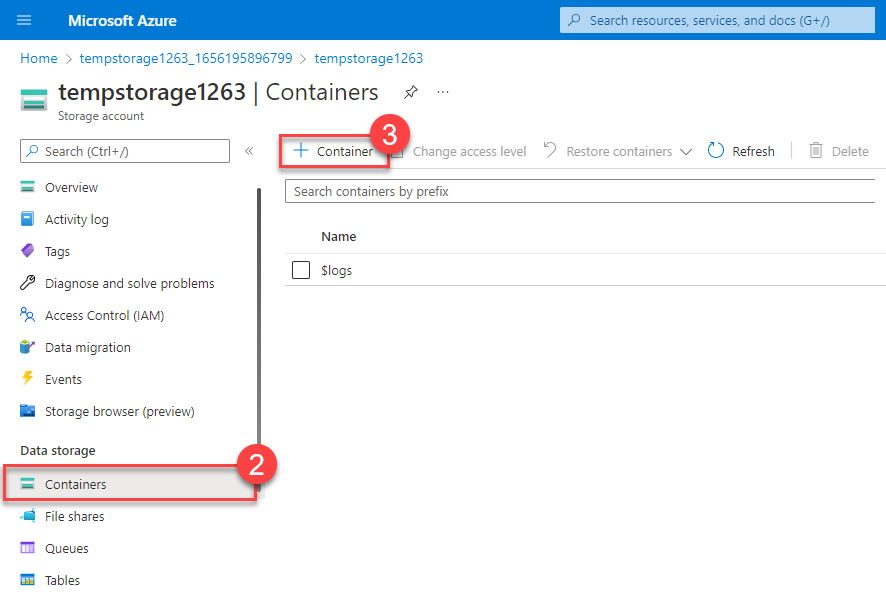
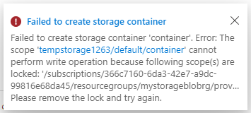
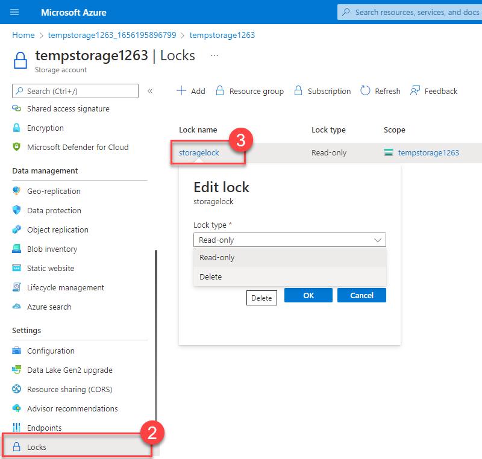
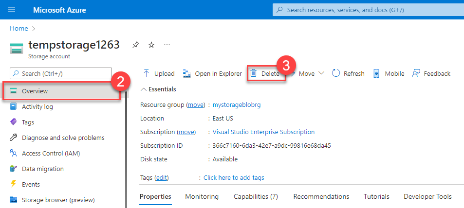
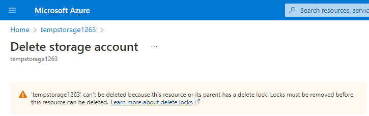
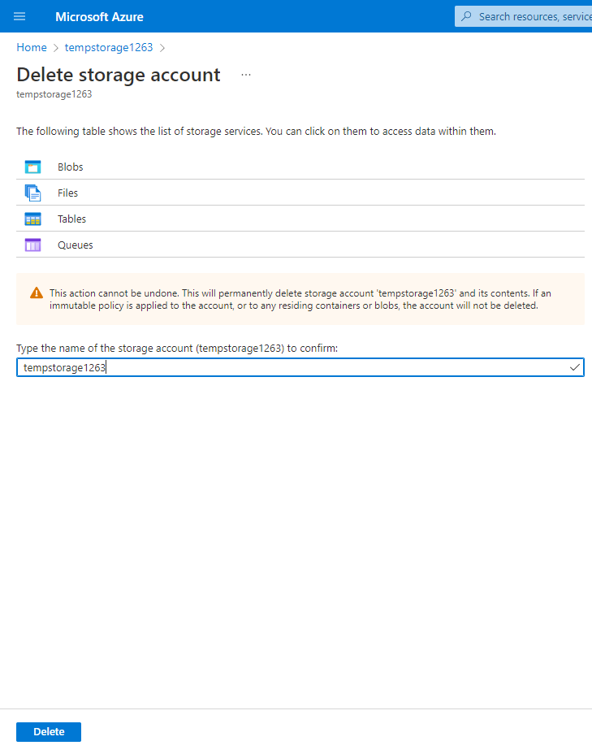

---
lab:
  title: 演習 - リソース ロックを構成する
  module: Module 02 - Describe features and tools in Azure for governance and compliance
  description: リソース ロックを作成して適用し、Azure リソースが誤って削除されないようにします。
  duration: 15 minutes
  level: 100
  islab: true
  primarytopics:
    - Azure
    - Resource Locks
---

<!--
Edit the metadata above to manage the list of exercises in the home page of the GitHub site that gets generated.
You can delete the module and edit index.md in the root of the repo to customize the display so that only the exercises are listed
To enable GitHub page publishing, edit the Page settings for the repo and publish from the main branch
-->

# リソース ロックを構成する <!-- match title in metadata above (and Learn Exercise unit and ILT slide)-->

この演習では、リソース ロックを使って、ファイルが誤って削除されるのを防ぎます。

この演習の所要時間は約 **15** 分です。 <!-- update with estimated duration -->

> [!IMPORTANT]
> この演習を終えるには、リソース グループ、ストレージ アカウント、リソース ロックを作成するための十分なアクセス許可を持って Azure サブスクリプションにアクセスする必要があります。
> この演習では、**米国中部** Azure リージョンを使います。

## タスク 1: リソース グループを作成する
このタスクでは、リソース グループを作成します。 この演習用のリソース グループを作成すると、完了時に演習をクリーンアップしやすくなります。

1. [Azure Portal](https://portal.azure.com/?azure-portal=true) にログインします。
1. **[リソース グループ]** を選択します。
1. **［作成］** を選択します
1. **[サブスクリプション]** ドロップダウン リストから、この演習に使うサブスクリプションを選びます。
1. リソース グループ名に「```IntroAzureRG```」と入力します。
1. Azure リージョンとして **[米国中部]** を選びます。
1. **[Review + create](レビュー + 作成)** を選択します。
1. **［作成］** を選択します
1. **[ホーム]** を選択します。


## タスク 2: リソースを作成する

リソース ロックを適用するには、Azure でリソースを作成する必要があります。 最初のタスクでは、後続のタスクでロックできるリソースの作成に重点を置きます。

1.  **[リソースの作成]** を選択します。
1.  [カテゴリ] で **[インフラストラクチャ サービス]** を選びます。
1.  [ストレージ アカウント] で、**[作成]** を選択します。
1.  [ストレージ アカウントの作成] ブレードの [基本] タブで、次の情報を入力します。 その他は既定値のままにします。
    
    | **設定**          | **Value**                           |
    | -------------------- | ----------------------------------- |
    | リソース グループ       | **[IntroAzureRG]** を選びます             |
    | ストレージ アカウント名 | 一意のストレージ アカウント名を入力します |
    | Location             | 米国中部 (リソース グループと同じ) |
    | パフォーマンス          | Standard                            |
    | 冗長性           | ローカル冗長ストレージ (LRS)     |
5.  **[確認と作成]** を選んでストレージ アカウントの設定を確認し、Azure が構成を検証できるようにします。
5.  検証が完了したら、**[作成]** を選択します。 アカウントが正常に作成されたことを示す通知を待ちます。
5.  **[リソースに移動]** を選択します。

## タスク 3: 読み取り専用リソース ロックを適用する

このタスクでは、読み取り専用リソース ロックをストレージ アカウントに追加します。 ストレージ アカウントにどのような影響があると思いますか?

1.  画面の左側にあるブレードの [設定] セクションが見つかるまで下にスクロールします。
2.  **[ロック]** を選択します。
3.  **[+ 追加]** を選択します。

![読み取り専用ロックに設定されたストレージ アカウントの [ロックの追加] 機能のスクリーンショット。](./Media/read-only-lock-e7777623.png)

4.  [ロック名] を入力します。
4.  [ロックの種類] が [読み取り専用] に設定されていることを確認します。
4.  **[OK]** を選択します。

## タスク 4: ストレージ アカウントにコンテナーを追加する

このタスクでは、ストレージ アカウントにコンテナーを追加します。 このコンテナーは、BLOB を格納できる場所です。

1.  画面の左側にあるブレードの [データ ストレージ] セクションが見つかるまで上にスクロールします。
2.  **[コンテナー]** を選択します。
3.  **[+ コンテナー]** を選択します。


4.  コンテナー名を入力して、**[作成]** を選びます。
5.  "ストレージ コンテナーを作成できませんでした" というエラー メッセージが表示されます。



> [!NOTE]
> エラー メッセージから、ロックが設定されているためにストレージ コンテナーを作成できなかったことがわかります。 読み取り専用ロックにより、ストレージ アカウントの作成または更新の操作ができないため、ストレージ コンテナーを作成できません。

## タスク 5: リソース ロックを変更し、ストレージ コンテナーを作成する

1.  画面の左側にあるブレードの [設定] セクションが見つかるまで下にスクロールします。
2.  **[ロック]** を選択します。
3.  作成した読み取り専用リソース ロックを選択します。
4.  [ロックの種類] を [削除] に変更して、**[OK]** を選びます。



5.  画面の左側にあるブレードの [データ ストレージ] セクションが見つかるまで上にスクロールします。
5.  **[コンテナー]** を選択します。
5.  **[+ コンテナー]** を選択します。
5.  コンテナー名を入力して、**[作成]** を選びます。
5.  ストレージ コンテナーがコンテナーの一覧に表示されます。

読み取り専用ロックによってなぜストレージ アカウントにコンテナーを追加できないのかが理解できました。 ロックの種類が変更されると (代わりに削除しました)、コンテナーを追加できました。

## タスク 6: ストレージ アカウントを削除する

実際には、この最後のタスクを 2 回行います。 ストレージ アカウントには削除ロックがあるため、実際にはまだストレージ アカウントを削除できないことに注意してください。

1.  画面の左側にあるブレードの上部に [概要] が表示されるまで上にスクロールします。
2.  **[概要]** を選択します。
3.  **[削除]** を選択します。

    

削除ロックがあるためにリソースを削除できないことを知らせる通知が届くはずです。 ストレージ アカウントを削除するには、削除ロックを解除する必要があります。



## タスク 7: 削除ロックを解除し、ストレージ アカウントを削除する

最後のタスクでは、リソース ロックを解除し、Azure アカウントからストレージ アカウントを削除します。 このステップは重要です。 アカウントにただ存在する、アイドル状態のリソースがないことを確認する必要があります。

1.  画面の上部にある階層リンクでストレージ アカウント名を選択します。
2.  画面の左側にあるブレードの [設定] セクションが見つかるまで下にスクロールします。
3.  **[ロック]** を選択します。
4.  **[削除]** を選択します。
5.  画面の上部にある階層リンクで **[ホーム]** を選びます。
6.  **[ストレージ アカウント]** を選択します。
7.  この演習で使用したストレージ アカウントを選択します。
8.  **[削除]** を選択します。
9.  誤って削除されないようにするために、Azure では削除するストレージ アカウントの名前を入力するように求められます。 ストレージ アカウントの名前を入力して、**[削除]** を選びます。



10. ストレージ アカウントが削除されたというメッセージが表示されます。 [ホーム] &gt; [ストレージ アカウント] に移動すると、この演習用に作成したストレージ アカウントがなくなったことがわかります。

## タスク 8: クリーンアップする

この演習で作成した資産をクリーンアップし、不要なコストを回避するには、リソース グループ (および関連するすべてのリソース) を削除します。
1. Azure のホーム ページで、[Azure サービス] の下にある **[リソース グループ]** を選びます。
1. **[IntroAzureRG]** リソース グループを選びます。
1. **[リソース グループの削除]** を選択します。
1. 「`IntroAzureRG`」と入力してリソース グループの削除を確認し、**[削除]** を選びます。
1. 確認ウィンドウで **[削除]** を選びます。

お疲れさまでした。 Azure リソースのリソース ロックの構成、更新、削除が完了しました。
